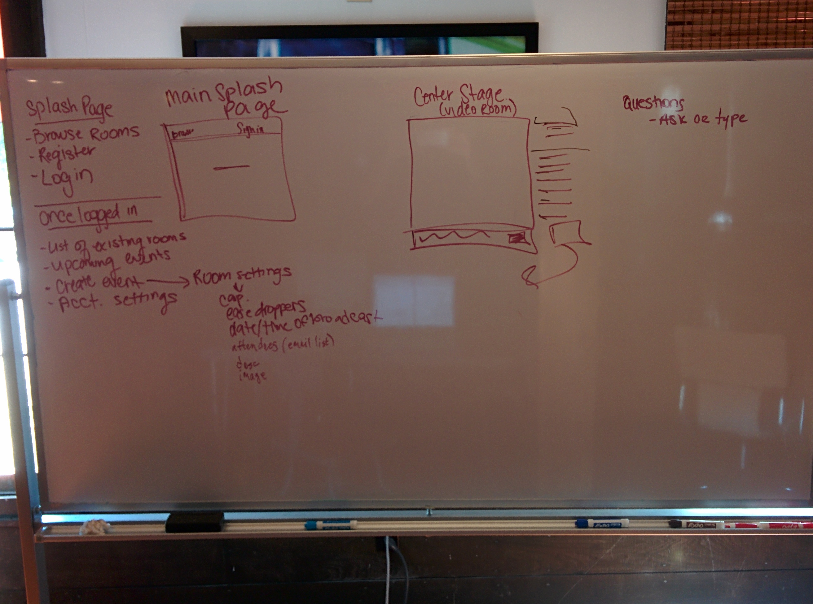

# Requirements

## Objective

To create a real time video application that will focus on live
streams of conferences, lectures and events.

## Team Members

   - Lindsay Eisberg
   - Travis Nesland

## MVP Features

   - [ ] Users will be given the option of logging in as guest or creating
     an account. If you are a guest you will only have the option to
     listen to the speaker without participating, whereas users will
     have full access.

   - [ ] Creating an account provides you with the option of starting your
     own room and if you will allow guests to “ease drop,” meaning
     those without accounts can join.
     
   - [ ] Users can schedule events and invite potential attendees

   - [ ] Select from a list of rooms/events to join. Each room will
     have a capacity limit of x based on streaming capabilities.

   - [ ] These rooms will have a center-stage where the broadcast will
     stem from.

   - [ ] Only the moderator and clients on the center-stage are
     contributing to the stream

   - [ ] Moderator can add/remove users from the center-stage in
     real-time.

   - [ ] Moderator can see the queue and select an individual, bring
     their question to the center-stage and present the answer to all
     those participating. Alternatively, the viewer (and their
     question) can stay in queue, until it is a good time to answer.

## MVP Stories

```
As a moderator, 
I want to set up video conferences
so that I can interact with those that want to virtually attend my event.
```

```
As a user
I want to create an account and login
so that I can participate and subscribe to events
```

```
As a guest
I want to browse upcoming events
so that I can listen to those that I find interesting.
```

```
As a moderator,
I want to broadcast my event
so that my subscribers can get my content.
```

```
As a participant,
I want to add a question to the question queue
so that I can better understand the lecture topic.
```

```
As a moderator,
I want to see the list of invited users with their attendance status
so that I know who I am talking to.
```

```
As a moderator / participant,
I want to be able to send chat data
so that I can help people get their audio / video setup when they are having problems.
```

```
As a user
I want to be able to search for events
so that I can subscribe to events that I am interested in.
```

```
As a moderator
I want to be able to search for users
so that I can invite people to my events.
```

```
As a moderator, 
I want to be able to set up my event room based on a set of criteria
so that I can maintain a stable environment.
```

## Technologies

- Workflow
  - GitHub
- FrontEnd
  - HTML
  - CSS
    - Bootstrap
  - Javascript
    - AngularJS
    - AngularUI
    - UI Bootstrap
    - angular-devise
- Backend
  - Rails
    - rails-api
    - devise
    - jbuilder
  - Database
    - sqlite3 (development, testing)
    - postgres (production)
- Services
  - TokBox (WebRTC)

## Wireframes

- 2015-03-10:
  

## Roadmap (additional features)

   - [ ] Attaching documents to events.
   - [ ] Creating different experiences based on what you are
     broadcasting.
     - Examples: Lectures will have a different participant interaction
       than live music or larger audience rooms.
   - [ ] Subscriptions to different vendors, streams, channels, rooms
   - [ ] Viewing statistics (participation, chat-activity, eye-tracking
     stats, etc.) as time-course data
   - [ ] adding a track feature that will act like a fully functional
     course manager.
